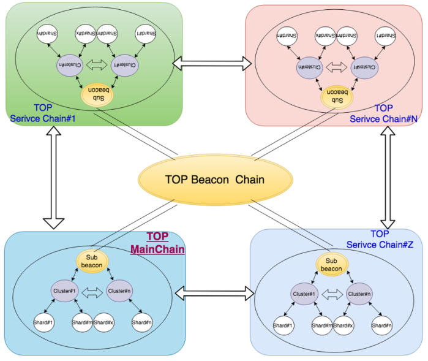

# 概述

TOP Network是全球首个实现完全分片，完全无许可的公链。它可以提供极高的TPS，实现了极短的确认时间和低至零的交易费用。构建具有这些特征的链非常困难，需要极为复杂的技术。因此，我们设计了一个多层扩容方案，来实现这些目标。

TOP Network把扩容技术融入了Layer-0、Layer-1和 Layer-2，打造了一个多层扩容的典范。有了在P2P网络、链分片、多链架构等更多技术领域的突破，TOP NetWork实现了真正的线性扩容。

基础设施层包括一个高度优化的P2P网络(Layer-0)，以及基于其实现的全分片，拥有基于PoS的新型、高性能并行pBFT共识机制的主链(Lay-1)、可插拔的业务链及单向状态通道技术(Layer-2)。

## 总体设计

TOP Network采用了多链架构。整个链由255个一级(level-1)链组成，其中包括主链和业务链。每个一级链本身最多可以支持255个二级(level-2)子链，依此类推。例如，开发人员可以将自己的二级链从主VPN服务链上分出去，以支持自己的业务。

一级链是互不相同的松散耦合链。根据交易的目的，可以将交易路由到相应的一级链。如果是用于资产转移，则将交易路由到主链，如果是服务交易类型，则将交易路由到相关的服务链。

每个一级Beacon由一组公共节点组成。每个一级链网络之间的通信由TOP Network的P2P网络架构支持，并且允许节点之间跨链网络的高效通信。

## TOP Network主链

TOP Network主链采用多重分片、基于DAG数据结构的双层点阵等扩容技术、以及并行hpBFT共识机制等，使单链交易处理能力达10万TPS。更多内容请参见[全分片主链(Layer-0)](docs-cn/AboutTOPNetwork/TOPChainInfrastructure/ComprehensiveMulti-levelDynamicSharding(layer-1))。

## TOP Network Beacon链

正如其他链的分片架构一样，我们在设计中也引入了Beacon。但是，与其他Beacon的实现不同，TOP Network的Beacon是非常轻量级的，并且不涉及通过跨链接等方式确认共识过程的结果。其他分片项目中的Beacon就是如此，这会导致它们成为系统中的瓶颈，因为所有分片最终都依赖于单个链来帮助确认交易。

### Beacon 的目的

TOP Network的Beacon充当了系统的协调者和记账者等许多角色。它还处理节点注册和选举，以及标记、投票、削减和记录工作负载日志。这些参数的记录和过程的处理都通过Beacon系统合约实现。Beacon还通过定期产生时钟块，充当整个系统的全局时钟。

### Beacon 节点

在众多分片系统中，Beacon运行节点必须专门注册为“Beacon节点”。然而大多数的挖矿奖励都被分配给了处理交易的节点，这就可能导致Beacon节点的不足，最终导致Beacon趋于中心化。

在TOP Network上，默认情况下每个节点都是潜在的Beacon节点。系统通过VRF-FTS算法选择节点，节点拥有越多权益，被选中成为Beacon节点的概率越高，攻击权益越多的节点，所需花费的成本越高，从而保证了Beacon的安全。  

为了创建Beacon区块和执行Beacon智能合约，每轮选举共识将从整个节点池中随机选择256个节点。

## TOP Network业务链

每种业务都有不同的需求和工作流程，单个链并不能满足这些需求和流程。TOP Network引入了业务链，这是一种为某一具体业务而构建的链。例如，VPN service有VPN服务链、d-storage service有去中心化存储服务链。

业务方可以轻松地部署自己的个人业务链链，以满足其应用的需求。更多内容请参见[业务链和分布式存储(Layer-2)](docs-cn/AboutTOPNetwork/ServiceChainandDistributedStorage(layer-2).md)。

