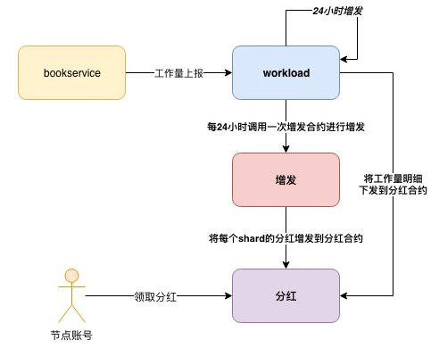

# 节点奖励制度

## 概述

系统增量发行TOP token形成奖励池。奖励池的20%为节点选票奖励，76%为节点工作量奖励，4%为链上治理委员奖励。对于设置了分红比例的节点，他收到的全部奖励要按照分红比例分到支持他的投票者账户上。

## 总奖励发行

系统创世预留给奖励的部分为200亿的38%，每年发行的比例是预留奖励剩余部分的8%（链上治理可调），随着预留奖励的剩余部分逐年减少，发行的比例也逐年减少。当发行的比例减少到低于2%（链上治理可调），之后每年将固定按照200亿的2%持续发行。

年总奖励比例计算方法：

第n年总奖励=max( 第n年年初剩余预留奖励*8%, 2%*200亿），创世年初剩余预留奖励值为38%*200亿 ；

比如，首年总奖励比例=38%*8%=3.04%，次年总奖励比例=(38%-3.04%)*8%=2.7968%。

## 工作量奖励

工作量奖励占总奖励的76%，按照工作类型的不同，奖励比例也不同，具体分为： 

| **工作类型** | **可担任此工作的节点类型** | **占总奖励百分比**   |
| ------------ | -------------------------- | -------------------- |
| 路由工作     | edge节点                   | 3%                   |
| 审计工作     | advance节点                | 10%（各cluster平分） |
| 验证工作     | validator节点，advance节点 | 60%（各shard平分）   |
| 存档工作     | advance节点                | 3%                   |

### 验证工作奖励

**奖励对象**

类型为"validator"或"advance"的节点。

**验证工作量统计**

每个unit块的head中都会记录该区块是出自于哪个validator leader，分片定时将每个validator在本分片内担任leader的出块数上报给Beacon，Beacon记录下每个validator在各个分片的验证工作量，以此进行验证工作奖励的计算。

**奖励规则**

先将总验证工作奖励按照分片平分，然后按照节点在该分片的验证工作量占比来分奖励。

年总验证工作奖励=unit出块数 / 分片出unit块数 \* 200亿 \* M% \* 60% / 分片数量

说明：

> M%为当年增量发行的比例。

### 审计工作奖励 

**奖励对象**

类型为"advance"的节点。

**审计工作量统计**

每个unit块的head中都会记录该区块是出自哪个auditor leader，分片定时将每个auditor在本分片内担任leader的出块数上报给Beacon，Beacon记录下每个auditor在各个分片的审计工作量汇总值，以此进行审计工作奖励的计算。 

**奖励规则**

先将总审计工作奖励（即总奖励池的10%）按照cluster平分，然后按照节点在该分片的审计工作量占比来分奖励。 

年总审计工作奖励=unit审计数/分片出unit块数 \* 200亿 \* M% \*10% /分片数量

说明：

> M%为当年增量发行的比例。

### 零工作量

如table合约固定周期内积累的工作量低于阈值，将不会上报工作量，如果一轮奖励的统计周期内，某个分片下的所有table没有上报过一笔工作量交易，则该分片在ZEC合约中的工作量会是0，此时在该分片中工作的节点为零工作量。

validator、auditor角色节点零工作量时，对应的工作量总奖励奖励将发给特定的公共合约账户。

即： 如果某个分片统计周期内“零工作量”，该分片的奖励将发给特定的公共合约账户；如果所有分片都是“零工作量”，本轮全部节点工作量奖励将发给特定的公共合约账户。

提醒：

> 投票给零工作量advance节点的投票者，也将拿不到“节点工作量奖励”部分的分红。

TCC可以通过链上治理对公共账户中的金额进行销毁，或者转账到TCC指定账户。

## 节点选票奖励

**奖励对象**

所有选票数＞0的节点。

**总节点选票奖励**

20%*总奖励。

**奖励计算与发放周期**

24小时

**票数统计**

分片定时将每个节点在本分片内获得的票数汇总值上报给Beacon，Beacon根据将节点在所有分片的票数加和可得某节点的总票数，以此进行节点选票奖励的计算。

**奖励规则**

按照节点的得票数占比分配总节点选票奖励。

节点选票奖励*=投票数/全网总票数\*200亿 \* M% \*20%*

实现方式：

1.shard投票合约记录本shard内投票者给各个节点的票数。

2.shard投票合约收到一笔新的投票交易时，发现上一笔调用该合约的交易在5分钟前，会将所有节点的总票数在分片级别上的汇总上报给Beacon节点注册合约做全网级别的进一步汇总。

3.Beacon节点注册合约发现上一笔调用该合约的交易在24小时前，会计算奖励，并把奖励数据与金额下发给每个分片奖励领取合约。

4.用户调用shard奖励领取合约领取奖励。

## 奖励提现

每个节点24小时内可以申请提现一次。节点仅可以对已经计算出奖励的部分进行提现，低于1000 TOP无法提现。

提现可以立即到账。

节点注销后，已经计算并发放到合约的奖励可以继续领取，但系统不会继续给此节点计算和发放更多奖励。

## 统计“工作量与奖励”流程

每隔5分钟，选出一个shard block共识组，共识leader将过去5分钟内unit block打包成shard block，并统计shard block中每个验证工作者leader/审计工作者leader签名unit 块以及edge工作者签名交易的数量，对此出一个块 → shard block 共识组对包含工作量统计unit 块的shard block进行共识 → 投递给高级节点审计，审计后触发“cluster级别奖励合约”的工作量修改。

每隔1小时，选出REC共识组，高级节点leader将过去1小时内shard block打包成zone block，并统计zone block中每个验证工作者leader、审计工作者leader以及edge工作者的工作量，对此出一个块 → zone block 共识组对包含工作量统计块的zone block 进行共识 → 投递给REC审计，审计后触发"zone"级别奖励合约”的工作量修改。

每隔24小时，REC触发奖励合约更新全部节点账户的奖励金额。

## 奖励发放流程

业务流：节点可查看自己总剩余待领取的奖励金额，并申请完成奖励的领取。每24小时最多领取一次，每次领取奖励金额需要≥1000TOP。

资金流：Beacon每24小时将当期奖励金额从38%挖矿资金池（或无中生有）中分别转到分片级别奖励池→ 节点或投票人申请提现，奖励资金到节点或投票人账户。

