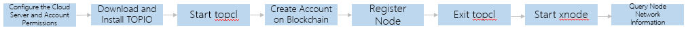

# Quick Start

This chapter explains how to send transactions on the blockchain and join the TOP Network quickly.



## Configure the Cloud Server and Account Permissions

The cloud server is configured according to the hardware requirements of nodes of different roles to connect the network, and the user type is "root" or normal user with "sudo" permissions.

The minimum hardware configuration pf each node are shown in the following table.

| Node Role | Hardware Configuration                 |
| --------- | -------------------------------------- |
| edge      | 2CPU/4GB men<br/>40GB SSD<br/>100Mb/s  |
| validator | 2CPU/4GB men<br/>60GB SSD<br/>100Mb/s  |
| auditor   | 4CPU/8GB men<br/>100GB SSD<br/>200Mb/s |
| archive   | 4CPU/8GB men<br/>100GB SSD<br/>200Mb/s |

## Download and Install TOPIO

Download and install TOPIO.For details,see [Install TOPIO](docs-en/Tools/TOPIO/InstallTOPIO.md)。

caution:

> The following samples use the root user account. If you use a normal user account (sudo permissions are required), prefix all commands with "sudo".

## Start topcl

After installing TOPIO,  execute the following command to entry the blockchain client "topcl".

```
topio topcl
```

## Create Account on Blockchain

In TOP Network, you should have an account on the blockchain first to interact with it:getting information, sending transaction, node management, etc.

Step 1 Create an account locally.

Execute the following command to create an account locally.

```
$> wallet createaccount
Please set a password for the account keystore file. The password must consist of Numbers and Letters, 8 to 16 characters.
Or Ctrl+D skips this step.
Please Input Password Again
Please set a password hint! If don't, there will be no hint when you forget your password.
basketball
Successfully create an account locally!

You can share your public key and account address with anyone.Others need them to interact with you!
You must nerver share the private key and account keystore file with anyone!They control access to your funds!
You must backup your account keystore file!Without the file,you’ll be impossible to access account funds!
You must remember your password!Without the password,it’s impossible to use the keystore file!
Public Key: BBtwShz7qgisA4RsjpvgmijBAAPlh9m/bRh2OsRLK7erroPUD0vFQcwWh4cwVlaIRugxq9b+L67JMztdLipeygc=
Account Address: T-0-LKQULGZTa6uGPDmEtLMaCLgy922NLQntNs
Account Keystore File Path: /root/Topnetwork/keystore/T-0-LKQULGZTa6uGPDmEtLMaCLgy922NLQntNs
```

The account keystore file will be generated after creating the loacl account. The default storage directory:/root/Topnetwork/keystore.

Step 2 Create an account on the blockchain.

Create your account on the blockchain by transferring TOP Token to the local account you created in the previous step, using an account with enough balance that has been created on the blockchain.

Confirm Account Balance

At least 100,000 uTOP Token is required as the transaction deposit to send transactions on the blockchain, otherwise the transaction will be discarded.

Caution：

> In TOPIO, account balance, transaction deposit,etc.The unit is uTOP, 1TOP=1*10^6 uTOP.

If the account‘s gas resources are sufficient, the deposit will be returned to your account immediately after the transaction is successful. If the account's gas resources are insufficient to pay the transaction costs, a fee shall be deducted from the transaction deposit to exchange gas resources to pay the transaction costs, and the deducted TOP Token will be destroyed.

If the transaction deposit is not enough to exchange enough gas resources, the transaction will eventually fail.

For transactions that call contracts deployed on the Root-beacon (registration node-related, proposal related, starting xnode), in addition to the minimum transaction deposit of 100,000 uTOP Token, the system will automatically deduct the 100*10^6 uTOP Token as transaction fee from the sender's account and then destroy it.

Therefore,to register node, in addition to the minimum deposit required for node registration (see [Registration Node](# registration Node)), the account balance should have an additional balance of at least 100.1*10^6 uTOP.

**Reset the Default Account**

Your newly created account is used as the default account to send transactions。

If you restart TOPIO , you need to execute the following command to reset the default account。

```
$>wallet SetDefault /root/Topnetwork/keystore/T-0-LVUuJXHbfzshf6RM44iCavc24SdMHHCQjE
T-0-LVUuJXHbfzshf6RM44iCavc24SdMHHCQjE: Set default account successfully.
```

## Register Node 

Step 1 Create the public-private key pair.

Caution：

> Optionally, instead of creating a public-private key pair, you can use the node account public-private key pair as the Node Key when registering node.

To protect your account assets better, it is recommended that you use `Wallet createKey` to create a key pair of asset-free as the Node key, which is used to sign the node when it is working after it has been registered into the network.

Caution：

> Make sure the keystore file of your Node Key is on the server where your TOPIO is currently running.

```
$> wallet createkey
Please set a password for the keystore file. The password must consist of Numbers and Letters, 8 to 16 characters.
Or Ctrl+D skips this step.
Please Input Password Again
Please set a password hint! If don't, there will be no hint when you forget your password.
basketball
Successfully create an key locally!

You can share your public key with anyone.Others need it to interact with you!
You must nerver share the private key and keystore file with anyone!They can use them to make the node malicious.
You must backup your keystore file!Without the file,you may not be able to send transactions.
You must remember your password!Without the password,it’s impossible to use the keystore file!
Public Key: BBYTqmkmNksMjX/ydgnixYP1fVmd0zHQGqW1xCBo4zXNrWf3H/XXqe+NsUkvrSuZ4wtDbJqdE7NDU752gMFd5+g=
Keystore File Path: /root/Topnetwork/keystore/Lgq6CojT16wVRSCEuGcsQRPg8eRsz3auyJ
```

Step 2 Register node.

TOP Network currently has three types of nodes: Edge node, Validator node, and Advance node. You can register as one of these types of nodes.

Advanced nodes can perform multiple roles in different networks: Validator, Auditor, and Archive. To register advanced nodes, the nodes need to register with the highest deposit of these three roles, i.e., the minimum deposit for registering advanced nodes is 1,000,000*10^6 uTOP.

The minimum registration deposit of each node is shown in the table below.

| Node Role | Registration Deposit |
| --------- | -------------------- |
| edge      | 100,000*10^6 uTOP    |
| validator | 500,000*10^6 uTOP    |
| auditor   | 1,000,000*10^6 uTOP  |
| archive   | 1,000,000*10^6 uTOP  |

Execute the following command to register the node.

```
$> system registerNode 500000000000 validator qiqi BBYTqmkmNksMjX/ydgnixYP1fVmd0zHQGqW1xCBo4zXNrWf3H/XXqe+NsUkvrSuZ4wtDbJqdE7NDU752gMFd5+g=
$> {
   "errmsg" : "ok",
   "errno" : 0,
   "sequence_id" : "28",
   "tx_hash" : "0x15109aaf5f3084f66dc8767a39787abc0629d8eb66099e0712f39033af7e26c3",
   "tx_size" : 261
}
Please use command 'get transaction' to query transaction status later on!!!
```

The request parameters are shown in the table below.

| Parameter Name   | Required | Default  Value | Parameter Type | Description                                                  |
| ---------------- | -------- | -------------- | -------------- | ------------------------------------------------------------ |
| register_deposit | Yes      | -              | Uint64         | Node registration deposit，the unit is uTOP。                |
| node_type        | Yes      | -              | String         | The node type includes edge node, validator and advanced node. The advanced node can perform roles as archive, validator, and auditor.<br/>You can register as one of the three types.<br/>After registering as an advance node, what kind of wokr role the node is elected depends on the votes it receives:<br/>If the advance node is to be elected as the role of auditor, archive, REC or ZEC, the vote must be greater than or equal to the actual registration deposit of the node (here, the node deposit is calculated byTOP, not utop).<br/>When the votes falls below the actual pledge deposit the Advance node can only be selected as validator.<br/>Caution：<br/>Node's votes must be voted by other nodes or by this node himself. |
| nodename         | Yes      | -              | String         | Node nick name.                                              |
| node_sign_key    | Yes      | -              | String         | You can use the public-private key pair of the node account as the Node Key registered with the node.<br/>It is recommended that you use `wallet createKey` to create a pair of asset-free public and private key pairs to protect your account assets better, which are used to sign the nodes when they are working after they have joined the network.<br/>Please enter the corresponding public key (base64), which can be used by other nodes for decryption. |

After executing the command, the transaction hash is returned to query whether the transaction is successful or not, and whether the node information can be queried to determine whether the node registration is successful. If the transaction is successful and the node information can be queried, the node registration is successful; if the transaction fails and the node information cannot be queried, the registration fails.

Query transaction information please refer to [Get Information from the Blockchain](docn-en/Tools/TOPIO/topcl/get.md).

Query node information please refer to [System Transaction](docs-en/Tools/TOPIO/topcl/system.md).

In addition to node registration, you can also sending other transactions on the blockchain, such as staking, voting node,etc.

## Exit topcl

After completing node registration in topcl, you needs to exit tocl and start the node process xnode before joining the TOP Network physical network and entering the candidate pool to wait for the election. For the Node election rules, see [Node Election](docs-en/Node/NodeElection.md).

Executing the following command to exit topcl.

`exit`、`q`、`quit`、`logout`.

## Start xnode

Caution：

> To facilitate the query of the information after the node is connected to the network, it is recommended that you use the TOPIO console mode here, that is, start xnode and topcl at the same time when entering the interactive environment.
>
> In order to run multiple node processes locally, you must ensure that each node has a separate data directory.

Execute the following command to start TOPIO in console mode.

```
topio --account_addr T-0-LVUuJXHbfzshf6RM44iCavc24SdMHHCQjE -k /root/Topnetwork/keystore/Lgq6CojT16wVRSCEuGcsQRPg8eRsz3auyJ --password 123456789jjj --datadir /home/cathy4 console
```

The optional description is shown in the following table.

| Option Name    | Default Value | Type   | Description                                                  |
| -------------- | ------------- | ------ | ------------------------------------------------------------ |
| --account_addr | -             | String | Node account address.                                        |
| -k,--keystore  | -             | String | The keystore file path of the Node Key set during registration of this node.For example, if the node account public-private key pair is used as the Node Key,here is the node account keystore file path.If a public-private key pair is used as the Node key, here is the public-private key pair keystore file path. |
| -p,--password  | -             | String | The password of the account keystore or the public-private key pair keystore file corresponding to the node key. |
| -d,--datadir   | -             | String | Specify the data directory for the node. If not specified, the data directory of the node is the default path of the system. If you specify the data directory / home / cathy4, the keystore file and blockchain data are stored in this directory by default. |

## Query Node Network Information

### Net Joined

Execute the following command to query whether the node was successfully joined the physical network.

```
xnode net joined
```

If returns "true", the node is successfully joined the network; If returns "false", the node failed to join.

### Network ID

Execute the following command to query the node's network ID after the node has been elected.

```
xnode net netID
```

| ID                                                           | Network                                       |
| ------------------------------------------------------------ | --------------------------------------------- |
| xnetwork_id[0]                                               | The node has not been elected to the network. |
| xnetwork_id[0] zone_id[1]、cluster_id[0]、group_id[0]        | Beacon Network                                |
| xnetwork_id[0] zone_id[2]、cluster_id[0]、group_id[0]        | ZEC Network                                   |
| xnetwork_id[0] zone_id[14]、cluster_id[1]、group_id[1]       | Archiver Network                              |
| xnetwork_id[0] zone_id[15]、cluster_id[1]、group_id[1]       | Edger Network                                 |
| xnetwork_id[0] zone_id[0]、cluster_id[1]、group_id[n],n∈[1,63] | Auditor Network                               |
| xnetwork_id[0] zone_id[0]、cluster_id[1]、group_id[m],m∈[64,126] | Validator Network                             |

Please use the xnode command to query more information about the network. For details, please refer to [Query Node Network Information](docs-en/Tools/TOPIO/xnode/command.md) 。