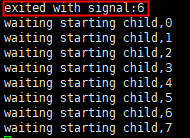

# Start TOPIO

## Overview

Please installing TOPIO before starting it.

Support to start TOPIO in different modes:

* Start topcl

Start topcl only。

* Start xnode

Start node process xnode only.

* Console Mode

Start xnode and topcl when entering the interactive environment。

* Attach Mode

Entering the interactive environment, meanwhile connecting to the node process xnode runing on locally or another node server, and starting topcl. 

caution:

> The following samples uses the root user account. If you have a normal user account (sudo permissions are required), prefix all commands with "sudo".

### Start topcl

Under TOPIO, execute the following command to enter the topcl interactive environment.

`topio topcl`

After starting topcl, you can interact with the blockchain:sending transactions, registering nodes, node staking, etc.

For more functions and usage of topcl, please refer to [topcl Instructions](docs-en/Tools/TOPIO/topcl/Overview.md)。

### Exit topcl

Executing the following command to exit topcl.

`exit`、`q`、`quit`、`logout`。

### Start xnode

Before starting the xnode, please register the node first. For details, please refer to [System Transaction](docs-en/Tools/TOPIO/topcl/system.md).

After the node registration is completed and the node process xnode is started, the node can join TOP Network physical network and enter the candidate pool to wait for election.

Caution:

> In order to run multiple node processes locally, you must ensure that each node has a separate data directory.

Execute the following command under TOPIO.

```
topio --account_addr T-0-LKXjgwdL9bTwADL89cBp7L2ze3wqiNmRB4 -k /root/key/keystore/T-0-LebeXEZGGTctfqA5Y8mnJroPckUDkE2hCW --password 123456789jjj --datadir home/cathy3
```

The optional description is shown in the following table.

| Option Name    | Default Value | Type   | Description                                                  |
| -------------- | ------------- | ------ | ------------------------------------------------------------ |
| --account_addr | -             | String | Node account address.                                        |
| -k,--keystore  | -             | String | The keystore file path of the node key set during registration of this node.For example, if the node account public-private key pair is used as the node key,here is the node account keystore file path.If a public-private key pair is used as the Node key, here is the public-private key pair keystore file path. |
| -p,--password  | -             | String | The password of the account keystore or the public-private key pair keystore file corresponding to the node key. |
| -d,--datadir   | -             | String | Specify the data directory for the node. Otherwise, the data directory of the node is the system's default dirrctory. If you specify the data directory / home / cathy3, the keystore file and blockchain data are stored in this directory by default. |

If the following "exited with signal" prompt is printed on the startup page, xnode fails to start; if there is no prompt below, xnode is successfully started.



### Stop xnode

Execute the following command to stop xnode.

```
[root@Jiao ~/top/xchain/cbuild/bin/Linux]# topio -s stop
signal:stop
env home:/root
found runing xnode_pid:28795
will send SIGKILL signal to pid:28795
done signal operations
```

Or use "Ctrl+C" and the Linux command "kill" to stop xnode.

### Query Node Network Information

You need to use TOPIO console mode or attach mode to enter the interactive environment to query the network information after the node joins the network.

For details, please refer to [Query Node Network Information](docs-en/Tools/TOPIO/topcl/xnode/command.md).

### Console Mode

Start xnode and topcl when entering the interactive environment.

If you have started the xnode process in the local background, you can stop the xnode process before using the console mode.

#### Entry Console Mode

Execute the following command to en entry console mode.

```
topio --account_addr T-0-LKXjgwdL9bTwADL89cBp7L2ze3wqiNmRB4 -k /root/key/keystore/T-0-LWkTjhseZj7tPZkXwifoTPm2dUJY63jdEd --password 123456789jjj --datadir home/cathy3 console
```

The optional description is shown in the following table.

| Option Name    | Default Value | Type   | Description                                                  |
| -------------- | ------------- | ------ | ------------------------------------------------------------ |
| --account_addr | -             | String | Node account address.                                        |
| -k,--keystore  | -             | String | The keystore file path of the Node Key set during registration of this node.For example, if the node account public-private key pair is used as the Node Key,here is the node account keystore file path.If a public-private key pair is used as the Node key, here is the public-private key pair keystore file path. |
| -p,--password  | -             | String | The password of the account keystore or the public-private key pair keystore file corresponding to the node key. |
| -d,--datadir   | -             | String | Specify a data directory for the node. If not specified, the data directory of the node is the default path of the system. If you specify the data directory / home / cathy4, the keystore file and blockchain data are stored in this directory by default. |

#### Console Help

```
NAME:
    console

USAGE:
    command [arguments...]

COMMANDS:
    help                     Show a list of commands and options.
    topcl                    A command line interface to interact with the blockchain and manage accounts.
    xnode                    Xnode is the core service daemon that runs on every TOP Network node.
```

#### Console Command

| Command | Description                                                  |
| ------- | ------------------------------------------------------------ |
| help    | Show a list of commands and options.                         |
| topcl   | Command line client for account management and interaction with the blockchain.<br/>Caution<br/>You need to add "topcl" before the topcl's command in console mode, such as "topcl wallet list" 。 |
| xnode   | Xnode is the core node process running on TOP Network nodes, and integrates the functions of node network information query and node process daemon.<br/>Caution:<br/>You need to add "xnode" before the xnode's command to use xnode command in console mode, such as "topcl wallet list" 。 |

#### Exit Console Mode

Use the following methods to exit the console mode.

* Ctrl+C。

* Execute commond: `exit`、`q`、`quit`、`logout`。

### Attach Mode

Entering the interactive environment,meanwhile connecting to xnode runing on locally or another node server, and starting topcl.

If you have started the node process in the local background, you can use attach mode to connect to the local node directly.The admin_ http_ server's default value is "127.0.0.1", and the default port is "8000".

Caution：

> Before entrying attach mode, make sure that the connected node is running the xnode.

#### Entry Attach Mode

Under TOPIO, execute the following command to connect to xnode runing on locally or another node.

`topio attach --admin_http_server --admin_http_port`

If TOPIO specifies a different data directory, you need to add the directory.
`topio attach --admin_http_server --admin_http_port --datadir /root/mydir`

#### Attach Help

Please refer to [View Console Help](#View Console Help).

#### Attach command

Please refer to [Console Command](#Console Command).

#### Exit Attach Mode

Use the following methods to exit the console mode.

* Ctrl+C。

* Execute commond: `exit`、`q`、`quit`、`logout`。

## Database Management

Provide the blockchain database backup and restore function.

### Backup Database

**Request**

`topio db backup`

**Request Parameters**

| Parameter Name | Required | Default Value | Parameter Type | Description                |
| -------------- | -------- | ------------- | -------------- | -------------------------- |
| backupdir      | Yes      | -             | Text           | Database backup directory. |

**Options**

| Option Name | Value | Type | Description                                                  |
| ----------- | ----- | ---- | ------------------------------------------------------------ |
| -h,--help   | -     | -    | View command help.                                           |
| -d,--dir    | -     | TEXT | Database source directory, the default is the current data directory. |

**Request Sample**

In the following request sample, the database sourcedirectory is "/root/topnetwork", and the database backup directory is "/home/cathy2".

```
topio db backup -d /root/Topnetwork /home/cathy2
```

**Response**

* Successful 

```
Database backup operating successfully.
DBversion : 1
```

* Failed

```
Backup failed
Error: the /home/db or /home/pdb does not exist.
```

### Restore Database

Caution：

> The target directory to restore must be empty.

Execute the command `topio DB list_dbVersion`to query all database versions under the backup directory before restoring the database.

Select a version and restore to an empty directory. If no version is specified, the latest version is restored by default.

```
[root@localhost topio-0.0.0.0-debug]# topio db list_dbversion /home/cathy2
DBversion:1,timestamp:2020-06-05 07:04:02.
DBversion:2,timestamp:2020-06-05 07:07:29.
```

**Request**

`topio db restore`

**Request Parameters**

| Parameter Name | Required | Default Value | Parameter Type | Description                           |
| -------------- | -------- | ------------- | -------------- | ------------------------------------- |
| backupdir      | Yes      | -             | Text           | The backup directory of the database. |

**Options**

| Option Name    | Value | Type    | Description                                                  |
| -------------- | ----- | ------- | ------------------------------------------------------------ |
| -h,--help      | -     | -       | View command help.                                           |
| -d,--dir       | -     | Text    | The target directory for the database restore,and must be empty. |
| -D,--DBversion | -     | Integer | The backed up database version, if not specified, restores the latest version by default. |

**Request Sample**

```
topio db restore -d /home/peter2 /home/cathy2 -D 2
```

**Response**

* Successful

```
Database restore operating successfully.
```

* Failed

```
Restore failed
Error: The target dir for restore is not empty, please input a empty one.
```
