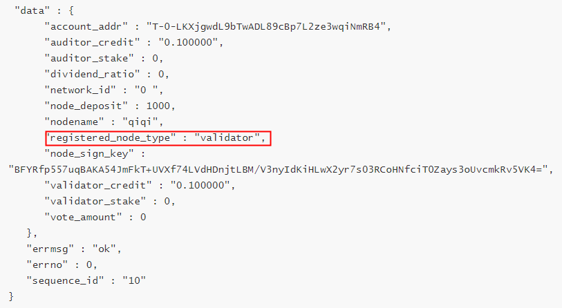

# System

## Overview

The system command is used to send transactions such as node registration, node voting, claiming node rewards, submiting proposals, and so on.

## System Commands

Execute `system -h` or ` system --help` view system commands.

```
COMMANDS:
    claimNodeReward                 Claim the node rewards.
    claimVoterDividend              Claim the voter dividend.
    listVoteUsed                    Query vote-used distribution.
    queryNodeInfo                   Query node information.
    queryNodeReward                 Query specific node rewards.
    queryProposal                   Query specific proposal details.
    queryVoterDividend              Query specific voter dividend.
    redeemNodeDeposit               Redeem node deposit when node regiter.
    registerNode                    Register as node.
    setDivident                     Set devident percentage to voters supporting your node.
    setNickname                     Set nickname.
    stakeDeposit                    Stake deposit.
    submitProposal                  The committee submit the on-chain governance proposal.
    tccVote                         TCC(TOP Network Community Council) vote on proposal.
    unregisterNode                  Node unregister.
    unstakeDeposit                  Unstake deposit.
    unvoteNode                      Unvote on nodes.
    updateNodeType                  Update node type.
    voteNode                        Vote on nodes.
    withdrawProposal                Withdraw proposal.

OPTIONS:
    -h --help                       Show a list of commands or help for one command.
```

Execute ` system claimNodeReward -h` or `system claimNodeReward --help` view help for subcommand `claimNodeReward`.

```
Claim the node rewards.

USAGE:
    system claimNodeReward

OPTIONS:
    -h --help                       Show help information for one command.

EXAMPLE:
    system claimNodeReward
```

## Command Instructions

### Transaction Costs

Make sure that you have an account on the blockchain and the account has sufficient gas resources and at least 100,000 uTOP token balance as the transaction deposit before sending transactions, otherwise the transaction will be discarded.

If gas resources are sufficient, the transaction deposit will be returned to your account immediately after the transaction is successful.A fee shall be deducted from the transaction deposit to exchange gas resources to pay the transaction costs  if the account's gas resources are insufficient to pay the transaction costs, and the deducted TOP token will be destroyed.

If the transaction deposit is not sufficient to convert enough gas resources to pay the transaction costs, the transaction will eventually fail.

More about transaction costs,please refer to [Resource Model](docs-en/AbountTOPNetwork/Protocol/ResourceModel.md).

The system will automatically deduct 100*10^6 uTOP Token from the transaction sender's account as the transaction fee for running Beacon system contract transaction (registration node related, proposal related, starting node process) and destroy it.

More about Beacon contract,please refer to [Smart Contract](docs-en/SmartContract/SmartContract.md).

### Register Node

TOP Network currently has three types of nodes: Edge node, Validator node, and Advance node. You can register as one of these types of nodes.

Advanced nodes can perform multiple roles in different networks: Validator, Auditor, and Archive. To register advanced nodes, the nodes need to register with the highest deposit of these three roles, i.e.,the minimum deposit for registering advanced nodes is 1,000,000*10^6 uTOP.

The minimum registration deposit of each node is shown in the table below.

An advanced node cannot alternate between an auditor group and its validator group under its jurisdiction.

The minimum registration deposit of each node is shown in the table below.

| Node Role | Registration Deposit |
| --------- | -------------------- |
| edge      | 100,000*10^6 uTOP    |
| validator | 500,000*10^6 uTOP    |
| auditor   | 1,000,000*10^6 uTOP  |
| archive   | 1,000,000*10^6 uTOP  |

Caution：

> Afterthe node registration (including the first registration and re-registration after logout), xnode needs to be started before node joining the TOP Network physical Network and entering the candidate pool to wait for the election. Start xonde please refer to [start TOPIO](docs-en/Tools/TOPIO/StartTOPIO.md) .

**Request**

`system registerNode`

**Request Parameters**

| Parameter Name   | Required | Default  Value | Parameter Type | Description                                                  |
| ---------------- | -------- | -------------- | -------------- | ------------------------------------------------------------ |
| register_deposit | Yes      | -              | Uint64         | Node registration deposit，the unit is uTOP。                |
| node_type        | Yes      | -              | String         | The node type includes edge node, validator and advanced node. The advanced node can perform roles as archive, validator, and auditor.<br/>You can register as one of the three types.<br/>After registering as an advance node, what kind of wokr role the node is elected depends on the votes it receives:<br/>If the advance node is to be elected as the role of auditor, archive, REC or ZEC, the vote must be greater than or equal to the actual registration deposit of the node (here, the node deposit is calculated byTOP, not utop).<br/>When the votes falls below the actual pledge deposit the Advance node can only be selected as validator.<br/>Caution：<br/>Node's votes must be voted by other nodes or by this node himself. |
| nodename         | Yes      | -              | String         | Node nick name.                                              |
| node_sign_key    | Yes      | -              | String         | You can use the public-private key pair of the node account as the Node Key registered with the node.<br/>It is recommended that you use `wallet createKey` to create a pair of asset-free public and private key pairs to protect your account assets better, which are used to sign the nodes when they are working after they have joined the network.<br/>Please enter the corresponding public key (base64), which can be used by other nodes for decryption. |

**Options**

| Option Name | Default Value | Type | Description           |
| ----------- | ------------- | ---- | --------------------- |
| -h,--help   | -             | -    | Help for the command. |

**Response Parameters**

| Parameter Name | Parameter Type | Description                                                  |
| -------------- | -------------- | ------------------------------------------------------------ |
| tx_hash        | String         | The transaction hash which can be used to query the transaction consensus status. |
| tx_size        | Uint16         | The gas consumed by transaction consensus is related to the transaction size. |

**Request Sample**

```
system registerNode 500000000000 validator qiqi BFYRfp557uqBAKA54JmFkT+UVXf74LVdHDnjtLBM/V3nyIdKiHLwX2yr7s03RCoHNfciT0Zays3oUvcmkRv5VK4=
```

**Response Schema**

* Successful

```
$> {
   "errmsg" : "ok",
   "errno" : 0,
   "sequence_id" : "28",
   "tx_hash" : "0x15109aaf5f3084f66dc8767a39787abc0629d8eb66099e0712f39033af7e26c3",
   "tx_size" : 261
}
Please use command 'get transaction' to query transaction status later on!!!
```

Execute `get transaction` to query the transaction consensus status is "success".Execute `system queryNodeInfo` to query the node information shown as below.



The above proves that the registration is successful.

* Failed

Register as  "Validator", but do not pledge enough despoit.

```
{
   "errmsg" : "ok",
   "errno" : 0,
   "sequence_id" : "20",
   "tx_hash" : "0xeb49aff52fbb76092eb2ab97646b5afa61e022e245f34e6ca2dba3370682b4a5",
   "tx_size" : 261
}
Please use command 'get transaction' to query transaction status later on!!!
```

Execute `get Transaction` to query the transaction status, the transaction fails,then the registration is failed.

### Unregister Node

The TOP Network nodes need to unregister first before exiting the network.

* Node unregistration needs to initiate by the node voluntarily.

* After the unregistration , the node registration deposit will not be immediately returned to the node account and will be locked for a period of time. If the node makes , the lock period will be extended.

* After the expiration of the locked registration deposit, the node shall redeem the despoit voluntarily, and the system will not automatically return it.

**Request **

`system unregister`

**Request Parameters**

None.

**Options**

| Option Name | Default Value | Type | Description           |
| ----------- | ------------- | ---- | --------------------- |
| -h,--help   | -             | -    | Help for the command. |

**Response**

| Parameter Name | Parameter Type | Description                                                  |
| -------------- | -------------- | ------------------------------------------------------------ |
| tx_hash        | String         | The transaction hash which can be used to query the transaction consensus status. |
| tx_size        | Uint16         | The gas consumed by transaction consensus is related to the transaction size. |

**Request Sample**

`system unregister`

**Response Schema**

* Successful

```
{
	"errmsg": "ok",
	"errno": 0,
	"sequence_id": "6",
	"tx_hash": "0x8159071ec087303cf673ed67e19d448826af0797c3030c9e77c6d081f5e09a87",
	"tx_size": 293
}
Please use command 'get transaction' to query transaction status later on!!!
```

Execute `get transaction` to query the transaction consensus status is "success",proves that the unregisteration is successful.

* Failed

Execute `get transaction` to query the transaction consensus status is "failure",proves that the unregisteration is failed.

### Update Node Name

**Request**

`system setNickname`

**Request Parameters**

| Parameter Name | Required | Default Value | Parameter Type | Description    |
| -------------- | -------- | ------------- | -------------- | -------------- |
| nodename       | Yes      | -             | String         | New node name. |

**Options**

| Option Name | Default Value | Type | Description           |
| ----------- | ------------- | ---- | --------------------- |
| -h,--help   | -             | -    | Help for the command. |

**Response Parameters**

| Parameter Name | Parameter Type | Description                                                  |
| -------------- | -------------- | ------------------------------------------------------------ |
| tx_hash        | String         | The transaction hash which can be used to query the transaction consensus status. |
| tx_size        | Uint16         | The gas consumed by transaction consensus is related to the transaction size. |

**Request Sample**

```
system setNickname baba
```

**Response Schema**

* Successful

```
{
   "errmsg":"ok",
   "errno":0,
   "sequence_id":"7",
   "tx_hash":"0x631c785ce9462ff6c7951f1a5e941af6d6910d54b29ccdc8f4fc388dc513b770",
   "tx_size":298
}
Please use command 'get transaction' to query transaction status later on!!!
```

Execute `get transaction` to query the transaction consensus status is "success", `system queryNodeInfo` to query node name update successfully.

* Failed

```
{
   "errmsg":"ok",
   "errno":0,
   "sequence_id":"12",
   "tx_hash":"0x3a4ac388896178c50ab777fb7947ac3028abe5298535800ecd918236f2c36c17",
   "tx_size":298
}
Please use command 'get transaction' to query transaction status later on!!!
```

Execute `get transaction` to query the transaction consensus status is "failure", `system queryNodeInfo` to query node name update unsuccessfully.

### Stake Deposit

You can increase the node deposit to improve your comprehensive stake at any time.

Increasing the node deposit does not change the type of node you have registered.

**Request**

`system stakeDeposit`

**Request Parameters**

| Parameter Name | Required | Default Value | Parameter Type | Description              |
| -------------- | -------- | ------------- | -------------- | ------------------------ |
| deposit        | Yes      | -             | Uint64         | Increased deposit(uTOP). |

**Options**

| Option Name | Default Value | Type | Description           |
| ----------- | ------------- | ---- | --------------------- |
| -h,--help   | -             | -    | Help for the command. |

**Response Parameters**

| Parameter Name | Parameter Type | Description                                                  |
| -------------- | -------------- | ------------------------------------------------------------ |
| tx_hash        | String         | The transaction hash which can be used to query the transaction consensus status. |
| tx_size        | Uint16         | The gas consumed by transaction consensus is related to the transaction size. |

**Request Sample**

```
stakeDeposit 200000
```

**Response Schema**

* Successful

```
{
   "errmsg":"ok",
   "errno":0,
   "sequence_id":"10",
   "tx_hash":"0xf8a59907230c19f78dc194d1d724c3ab3306702a85d860219e7300304b294546",
   "tx_size":307
}
Please use command 'get transaction' to query transaction status later on!!!
```

Execute `get transaction` to query the transaction consensus status is "success", `system queryNodeInfo` to query node deposit has corresponding change.

* Failed

Execute `get transaction` to query the transaction consensus status is "failure",failed to increase node deposit.

### Unstake Deposit

You can reduce the node deposit at any time. Reducing the deposit will not change the type of node you registered.But the reduction of the deposit will fail if the node's deposit balance is lower than the minimum deposit requirement for the current type of node.

**Request**

`system unstakeDeposit`

**Request Parameters**

| Parameter Name | Required | Default Value | Parameter Type | Description            |
| -------------- | -------- | ------------- | -------------- | ---------------------- |
| deposit        | 是       | -             | Uint64         | Reduced deposit(uTOP). |

**Options**

| Option Name | Default Value | Type | Description           |
| ----------- | ------------- | ---- | --------------------- |
| -h,--help   | -             | -    | Help for the command. |

**Response Parameters**

| Parameter Name | Parameter Type | Description                                                  |
| -------------- | -------------- | ------------------------------------------------------------ |
| tx_hash        | String         | The transaction hash which can be used to query the transaction consensus status. |
| tx_size        | Uint16         | The gas consumed by transaction consensus is related to the transaction size. |

**Request Sample**

`system unstakeDeposit 300000 `

**Response Schema**

* Successful

```
{
   "errmsg" : "ok",
   "errno" : 0,
   "sequence_id" : "30",
   "tx_hash" : "0xce9275be9176c53dadb445149e702a8c408f7007f3cb22e263483e6f30f2997d",
   "tx_size" : 380
}
Please use command 'get transaction' to query transaction status later on!!!
```

Execute `get transaction` to query the transaction consensus status is "success", `system queryNodeInfo` to query node deposit has corresponding change.

* Failed

Execute `get transaction` to query the transaction consensus status is "failure",failed to reduce node deposit.

### Redeem Node Deposit

After the unregistration , the node registration deposit will not be immediately returned to the node account and will be locked for a period of time. If the node makes , the lock period will be extended.

After the expiration of the locked registration deposit, the node shall redeem the despoit voluntarily, and the system will not automatically return it.

**Request**

`system redeemNodeDeposit`

**Request Parameters**

None.

**Options**

| Option Name | Default Value | Type | Description           |
| ----------- | ------------- | ---- | --------------------- |
| -h,--help   | -             | -    | Help for the command. |

**Response Parameters**

| Parameter Name | Parameter Type | Description                                                  |
| -------------- | -------------- | ------------------------------------------------------------ |
| tx_hash        | String         | The transaction hash which can be used to query the transaction consensus status. |
| tx_size        | Uint16         | The gas consumed by transaction consensus is related to the transaction size. |

**Request Sample**

`system redeemNodeDeposit`

**Response Schema**

* Successful

```
{
   "errmsg":"ok",
   "errno":0,
   "sequence_id":"3",
   "tx_hash":"0xcf612c66a8b33f0976e316f5002b49ca3cdbb7e854107b15c81c7ed04836a982",
   "tx_size":321
}
Please use command 'get transaction' to query transaction status later on!!!
```

Execute `get transaction` to query the transaction consensus status is "success", `get account` to query node account balance has corresponding change.

* Failed

Execute `get transaction` to query the transaction consensus status is "failure",failed to redeem node deposit.

### Update Node Type

Before updating the node type, please execute `System queryNodeInfo` to inquire whether the node deposit balance meets the minimum registeration deposit requirement for the new node type. If the not, the corresponding deposit difference shall be pledged when updating.

If the node deposit balance is greater than or equal to the minimum registeration deposit for the new type node, you can continue to increase the deposit for the node or not when the node type is updated.

Updating a node type can also be done with the command `system registerNode`. If the new type node requires more registeration deposit,the deposit difference will need to be increased when reregistering.

Similarly, if the node deposit balance is greater than or equal to the minimum registeration deposit for the new type node, you can continue to increase the deposit for the node or not when you re-register the node.

**Request**

`system updateNodeType`

**Request Parameters**

| Parameter Name | Required | Default Value | Type   | Description              |
| -------------- | -------- | ------------- | ------ | ------------------------ |
| deposit        | 是       | -             | Uint64 | Increased deposit(uTOP). |
| node_type      | 是       | -             | Object | Updated node type.       |

**Options**

| Option Name | Default Value | Type | Description           |
| ----------- | ------------- | ---- | --------------------- |
| -h,--help   | -             | -    | Help for the command. |

**Response Parameters**

| Parameter Name | Parameter Type | Description                                                  |
| -------------- | -------------- | ------------------------------------------------------------ |
| tx_hash        | String         | The transaction hash which can be used to query the transaction consensus status. |
| tx_size        | Uint16         | The gas consumed by transaction consensus is related to the transaction size. |

**Request Sample**

`system updatenodetype 300000 edge validator`

**Response Schema**

* Successful

```
{
   "errmsg":"ok",
   "errno":0,
   "sequence_id":"3",
   "tx_hash":"0xcf612c66a8b33f0976e316f5002b49ca3cdbb7e854107b15c81c7ed04836a982",
   "tx_size":321
}
Please use command 'get transaction' to query transaction status later on!!!
```

* Failed

Execute `get transaction` to query the transaction consensus status is "failure",failed to update node type.

### Query Node Information

**Request**

`system queryNodeInfo`

**Request Parameters**

| Parameter Name      | Required | Default Value | Parameter Type | Description                                                  |
| ------------------- | -------- | ------------- | -------------- | ------------------------------------------------------------ |
| target_account_addr | No       | -             | String         | Node account address.<br/>The default is to query all nodes's information. |

**Options**

| Option Name | Default Value | Type | Description           |
| ----------- | ------------- | ---- | --------------------- |
| -h,--help   | -             | -    | Help for the command. |

**Response Parameters**

| Parameter Name       | Parameter Type | Description                                                  |
| -------------------- | -------------- | ------------------------------------------------------------ |
| account_addr         | String         | Node account address.                                        |
| auditor_credit       | String         | Auditor credit.                                              |
| auditor_stake        | Uint64         | Auditor stake:auditor stake=(node deposit+vote amount)*auditor credit |
| dividend_ratio       | Integer        | Dividend ratio,percentage%,value[0,100]。                    |
| network_id           | String         | A value of 0 indicates that the node joins the mainchain network. |
| node_deposit         | Uint64         | Node deposit(uTOP).                                          |
| nodename             | String         | Node name.                                                   |
| registered_node_type | String         | Registered node type:<br/>edge，validator，advance.          |
| node_sign_key        | String         | Public key used in registering node.                         |
| validator_credit     | String         | Validator credit.                                            |
| validator_stake      | Uint64         | Validator stake:validator stake=(node deposit+vote amount)/2 |
| vote_amount          | Uint64         | Total number of votes received from voting.                  |

**Request Sample**

```
system queryNodeInfo T-0-LKXjgwdL9bTwADL89cBp7L2ze3wqiNmRB4
```

**Response Schema**

* Successful

```
 "data" : {
      "account_addr" : "T-0-LKXjgwdL9bTwADL89cBp7L2ze3wqiNmRB4",
      "auditor_credit" : "0.100000",
      "auditor_stake" : 0,
      "dividend_ratio" : 0,
      "network_id" : "0",
      "node_deposit" : 1000,
      "nodename" : "qiqi",
      "registered_node_type" : "validator",
      "node_sign_key" : "BFYRfp557uqBAKA54JmFkT+UVXf74LVdHDnjtLBM/V3nyIdKiHLwX2yr7s03RCoHNfciT0Zays3oUvcmkRv5VK4=",
      "validator_credit" : "0.100000",
      "validator_stake" : 0,
      "vote_amount" : 0
   },
   "errmsg" : "ok",
   "errno" : 0,
   "sequence_id" : "10"
}
```

* Failed

The node has not been registered.

```
{
	"data": null,
	"errmsg": "ok",
	"errno": 0,
	"sequence_id": "11"
}
```

### Query Node Reward

Node reward includes node work reward and voting reward.

**Request**

`system queryNodeReward`

**Request Parameters**

| Parameter Name      | Required | Default Value | Parameter Type | Description           |
| ------------------- | -------- | ------------- | -------------- | --------------------- |
| target_account_addr | Yes      | -             | String         | Node account address. |

**Options**

| Option Name | Default Value | Type | Description           |
| ----------- | ------------- | ---- | --------------------- |
| -h,--help   | -             | -    | Help for the command. |

**Response Parameters**

| Parameter Name  | Parameter Type | Description                                         |
| --------------- | -------------- | --------------------------------------------------- |
| accumulated     | Uint64         | Total amount of node reward.The unit is uTOP.       |
| last_claim_time | Uint64         | Clock height of the last time to claim node reward. |
| unclaimed       | Uint64         | Unclaimed reward.The unit is uTOP.                  |

**Request Sample**

`system queryNodeReward T-0-LKogyPKkA6owYPjPGrzYSe39KLTSVJUzS8`

**Response Schema**

* Successful

```
{
   "data" : {
      "accumulated" : 40458594,
      "last_claim_time" : 0,
      "unclaimed" : 40458594
   },
   "errmsg" : "ok",
   "errno" : 0,
   "sequence_id" : "53"
}
```

* Failed

```
{
	"data": null,
	"errmsg": "ok",
	"errno": 0,
	"sequence_id": "24"
}
```

### Claim Node Reward

You can use `system queryNodeReward` to query the node reward before you claim the node reward.。

Node reward can be received at most once every 24 hours, and each time the amount of reward should be ≥1,000*10^6 uTOP tokens.

**Request**

`system claimNodeReward`

**Request Parameters**

None.

**Options**

| Option Name | Default Value | Type | Description           |
| ----------- | ------------- | ---- | --------------------- |
| -h,--help   | -             | -    | Help for the command. |

**Response Parameters**

| Parameter Name | Parameter Type | Description                                                  |
| -------------- | -------------- | ------------------------------------------------------------ |
| tx_hash        | String         | The transaction hash which can be used to query the transaction consensus status. |
| tx_size        | Uint16         | The gas consumed by transaction consensus is related to the transaction size. |

**Request Sample**

`system claimNodeReward`

**Request Schema**

* Successful

```
{
	"errmsg": "ok",
	"errno": 0,
	"sequence_id": "11",
	"tx_hash": "0x589d064b2130e6bb99858f9be952e56c262e663ca23e453aae3a497dc44b6e23",
	"tx_size": 291
}
Please use command 'get transaction' to query transaction status later on!!!
```

Execute `get transaction` to query the transaction consensus status is "success", `get account` to query node account balance has corresponding change.

* Failed

Execute `get transaction` to query the transaction consensus status is "failure",failed to claim node reward.

### Node Vote

Make sure you have enough unused votes in your node account before voting. You can use the 'get Account' command to query. If you do not have enough votes in your account, you can exchange votes by command  `sendtx stakeVote`.

Node accounts on the blockchain can vote nodes and obtain rewards:

* You can vote for any node that contains the role of "auditor" (that is, an advance node).,

* The minimum number of votes voting on a node for the first time is 10,000, and the subsequent cumulative votes are unlimited.

* After voting on a node, a portion of the reward won by the node will be given to the voter.

**Request**

`system voteNode`

**Request Parameters**

| Parameter Name    | Required | Default Value | Parameter Type | Description                              |
| ----------------- | -------- | ------------- | -------------- | ---------------------------------------- |
| node_num          | Yes      | -             | Interger       | Number of nodes to be voted on.          |
| node_account_addr | Yes      | -             | String         | The target account address for the vote. |
| vote_ num         | Yes      | -             | Uint64         | Number of votes.                         |

**Options**

| Option Name | Default Value | Type | Description           |
| ----------- | ------------- | ---- | --------------------- |
| -h,--help   | -             | -    | Help for the command. |

**Response Parameters**

| Parameter Name | Parameter Type | Description                                                  |
| -------------- | -------------- | ------------------------------------------------------------ |
| tx_hash        | String         | The transaction hash which can be used to query the transaction consensus status. |
| tx_size        | Uint16         | The gas consumed by transaction consensus is related to the transaction size. |

**Request Sample**

```
system voteNode 2 T-0-LTSip8Xbjutrtm8RkQzsHKqt28g97xdUxg 200 T-0-LTBBRL1awrVhcisxCCMmgsB5XyPkRuBj9g 300
```

**Response Schema**

* Successful

```
{
	"errmsg": "ok",
	"errno": 0,
	"sequence_id": "7",
	"tx_hash": "0x2330f8d417bd6c51770df492272f5e9669717ec25a915d3d379e0ed52e462d07",
	"tx_size": 352
}
Please use command 'get transaction' to query transaction status later on!!!
```

Execute `get transaction` to query the transaction consensus status is "success", `get account` to query node unused vote amount has corresponding change.

* Failed

Execute `get transaction` to query the transaction consensus status is "failure",failed to vote on nodes.

### Unvote Node

A voter may cancel and withdraw votes at any time that has already been vote on a node.

The number of votes for each cancellation operation is unlimited, but cannot exceed the total number of votes vote on the nodes, otherwise the cancellation operation will fail.

After voting on the node, even if the node is unregistered, the votes will not be returned to your account. You need to initiate the cancellation operation.

You can cancel voting on nodes in bulk.

**Request**

`system unvoteNode`

**Request Parameters**

| Parameter Name    | Required | Default Vaule | Parameter Type | Description                           |
| ----------------- | -------- | ------------- | -------------- | ------------------------------------- |
| node_num          | Yes      | -             | Interger       | Node Number.                          |
| node_account_addr | Yes      | -             | String         | Account address to be cancelled vote. |
| vote_ num         | Yes      | -             | Uint64         | Number of cancelled votes.            |

**Options**

| Option Name | Default Value | Type | Description           |
| ----------- | ------------- | ---- | --------------------- |
| -h,--help   | -             | -    | Help for the command. |

**Response Parameters**

| Parameter Name | Parameter Type | Description                                                  |
| -------------- | -------------- | ------------------------------------------------------------ |
| tx_hash        | String         | The transaction hash which can be used to query the transaction consensus status. |
| tx_size        | Uint16         | The gas consumed by transaction consensus is related to the transaction size. |

**Request Sample**

```
system unvoteNode 1 T-0-LTSip8Xbjutrtm8RkQzsHKqt28g97xdUxg 100
```

**Request Schema**

* Successful

```
{
	"errmsg": "ok",
	"errno": 0,
	"sequence_id": "3",
	"tx_hash": "0xb740183a59398241ecf709d9003f607bb6dde40441b106d9edd795fde0da1208",
	"tx_size": 356
}
Please use command 'get transaction' to query transaction status later on!!!
```

Execute `get transaction` to query the transaction consensus status is "success", `get account` to query node unused vote amount has corresponding change.

* Failed

Execute `get transaction` to query the transaction consensus status is "failure",failed to cancel the votes.

### Set Dividend Ratio

Once the dividend ratio is set, all the rewards you receive, including the work rewards and your own voting rewards, will be distributed to the voter account that supports you according to the dividend ratio you set.

You can change the dividend ratio every 14 days.

**Request**

`system setDividendRatio`

**Request Parameters**

| Parameter Name | Required | Default Value | Parameter Type | Description                             |
| -------------- | -------- | ------------- | -------------- | --------------------------------------- |
| percent        | 是       | -             | Integer        | Percentage of dividends,value [0,100]。 |

**Options**

| Option Name     | Default Value      | Type   | Description                                                  |
| --------------- | ------------------ | ------ | ------------------------------------------------------------ |
| -h,--help       | -                  | -      | Help for the command.                                        |
| -t,--tx_deposit | 100,000 uTOP token | String | Transaction deposit.The unit is uTOP.Default to 100,000 uTOP token。 |

**Response Parameters**

| Parameter Name | Parameter Type | Description                                                  |
| -------------- | -------------- | ------------------------------------------------------------ |
| tx_hash        | String         | The transaction hash which can be used to query the transaction consensus status. |
| tx_size        | Uint16         | The gas consumed by transaction consensus is related to the transaction size. |

**Request Sample**

`system setDividendRatio 60`

**Response Schema**

* Successful

```
{
	"errmsg": "ok",
	"errno": 0,
	"sequence_id": "5",
	"tx_hash": "0x3586caae6a3871b48209beda70c7617b0cd51dcc07f1116cd63d537b377c278c",
	"tx_size": 303
}
Please use command 'get transaction' to query transaction status later on!!!
```

Execute `get transaction` to query the transaction consensus status is "success", successed to set the dividend ratio.

* Failed

Execute `get transaction` to query the transaction consensus status is "failure",failed to set the dividend ratio.

### Query Voter Dividend

After you vote on the nodes, you can get the corresponding voting dividends, and the dividend ratio is set by the nodes being voted.

Voter dividend is not immediately searchable and can be queried 6 hours after voting.

**Request**

`system queryVoterDividend`

**Request Parameters**

| Parameter Name      | Required | Default Value | Parameter Type | Description            |
| ------------------- | -------- | ------------- | -------------- | ---------------------- |
| target_account_addr | 是       | -             | String         | Voter account address. |

**Options**

| Option Name | Default Value | Type | Description           |
| ----------- | ------------- | ---- | --------------------- |
| -h,--help   | -             | -    | Help for the command. |

**Response Parameters **

| Parameter Name  |                 | Parameter Type | Description                                                  |
| --------------- | --------------- | -------------- | ------------------------------------------------------------ |
| accumulated     |                 | Uint64         | Total amount of voter dividend.The unit is uTOP.             |
| last_claim_time |                 | Uint64         | Clock height of the last time to claim voter dividend.       |
| node_dividend   |                 | List           | Dividend information of the node being voted.                |
|                 | account_addr    | String         | Account address of the node being voted.                     |
|                 | accumulated     | Uint64         | The dividend given to the voter by the node be voted.The unit is uTOP. |
|                 | last_claim_time | Uint64         | The height of the clock at which the dividend of the node was last claimed. |
|                 | unclaimed       | Uint64         | The unclaimed dividend given to the voter by the node be voted.The unit is uTOP. |
| unclaimed       |                 | Uint64         | The total amount of dividends the voter has not claimed.The unit is uTOP. |

**Request Sample**

`system queryVoterDividend T-0-LKogyPKkA6owYPjPGrzYSe39KLTSVJUzS8`

**Response Schema**

* Successful

```
{
   "data" : {
      "accumulated" : 1136005762,
      "last_claim_time" : 16632,
      "node_dividend" : [
         {
            "account_addr" : "T-0-LKogyPKkA6owYPjPGrzYSe39KLTSVJUzS8",
            "accumulated" : 1136005762,
            "last_claim_time" : 16632,
            "unclaimed" : 768988516
         }
      ],
      "unclaimed" : 768988516
   },
   "errmsg" : "ok",
   "errno" : 0,
   "sequence_id" : "82"
}
```

* Failed

```
{
	"data": null,
	"errmsg": "ok",
	"errno": 0,
	"sequence_id": "23"
}
```

### ClaimVoterDividend

The system will settle voter dividends every 24 hours and automatically distribute voter dividends to the dividend pool.

The voter can apply for withdrawal once within 24 hours, and the withdrawal will be received immediately after the application is initiated. If the withdrawal amount is less than 10*10^6 uTOP, the withdrawal will fail.

**Request**

`system claimVoterDividend`

**Request Parameters**

None.

**Options**

| Option Name | Default Value | Type | Description           |
| ----------- | ------------- | ---- | --------------------- |
| -h,--help   | -             | -    | Help for the command. |

**Response Parameters**

| Parameter Name | Parameter Type | Description                                                  |
| -------------- | -------------- | ------------------------------------------------------------ |
| tx_hash        | String         | The transaction hash which can be used to query the transaction consensus status. |
| tx_size        | Uint16         | The gas consumed by transaction consensus is related to the transaction size. |

**Request Sample**

`system claimVoterDividend`

**Response Schema**

* Successful

```
{
	"errmsg": "ok",
	"errno": 0,
	"sequence_id": "2",
	"tx_hash": "0x591c0f2fdc3a6e189bedefbe21e965c2aa7bfec70e31a0660fe2a00e02edea07",
	"tx_size": 286
}
Please use command 'get transaction' to query transaction status later on!!!
```

Execute `get transaction` to query the transaction consensus status is "success", `get account` to query node balance has corresponding change.

* Failed

Execute `get transaction` to query the transaction consensus status is "failure",failed to claim voter dividend.

### List Vote Used

Support to query the account‘s vote information, including the nodes be voted, the corresponding number of votes.

**Request**

`system listVoteUsed`

**Request Parameters**

| Parameter Name      | Required | Default Value | Parameter Type | Description            |
| ------------------- | -------- | ------------- | -------------- | ---------------------- |
| target_account_addr | 是       | -             | String         | Voter account address. |

**Options**

| Option Name | Default Value | Type | Description           |
| ----------- | ------------- | ---- | --------------------- |
| -h,--help   | -             | -    | Help for the command. |

**Response Parameters**

| Parameter Name | Parameter Type | 说明                                                         |
| -------------- | -------------- | ------------------------------------------------------------ |
| vote_infos     | Map Array      | Account address of node be voted(String)；Amount of votes(Integer). |

**Request Sample**

`system listVoteUsed T-0-LKogyPKkA6owYPjPGrzYSe39KLTSVJUzS8`

**Response Schema**

* Successful

```
{
   "data" : {
      "vote_infos" : {
         "T-0-LKXjgwdL9bTwADL89cBp7L2ze3wqiNmRB4" : 200
      }
   },
   "errmsg" : "ok",
   "errno" : 0,
   "sequence_id" : "80"
}
```

* Failed

```
{
	"data": null,
	"errmsg": "ok",
	"errno": 0,
	"sequence_id": "6"
}
```

### Submit Proposals

When governing on the blockchain,you first need to submit an on-chain governance proposal.

Any user can submit a proposal as long as a certain TOP token is pledged.

Caution:

> You must pledge at least 100*10^6 uTOP token as proposal deposit for 30 days before submitting a proposal. When it expires, the proposal deposit will be returned to your account automatically.
>
> In addition to the minimum transaction deposit of 100,000 uTOP token, the transaction fee of 100*10^6 uTOP token shall be deducted for running Beacon system contract transaction.
>
> So make sure you have at least 200.1*10^6 uTOP balance in your account before submitting your proposal.

#### On-Chain Parameter Modification Proposals

Only the TCC members have the right to vote on a proposal. For proposals of different levels, the voting rules are different:

* Normal:Approval by 51% of members is required.

* Important:It shall be approved by 51% of the members, and no more than 25% of the members shall abstain.

* Critical:Two-thirds of the committee members are required to approve, and no more than 20% of the members are opposed.

#### Community Fund Management Proposal

Community fund management proposal is "critical" level.

The system will issue governance rewards and zero workload rewards to the community fund account, community users can transfer these rewadrs to the burn account via community fund management proposal .Once the proposal has been voted through by TCC, the burn will take effect.

Catuion:

> * community fund account address：T-21-38QMHWxXshXyZa1E48JU1LREu3UrT5KGD2U@0。
> * burn account address：T-!-Ebj8hBvoLdvcEEUwNZ423zM3Kh9d4nL1Ug。

**Request**

`system submitProposal`

**Request Parameters**

| Parameter Name         | Required | Default Value | Parameter Type | Description                                                  |
| ---------------------- | -------- | ------------- | -------------- | ------------------------------------------------------------ |
| proposal_type          | 是       | -             | Uint8          | Proposal Type：1--on-chain parameter modification proposal；2--community fund management proposal. |
| target                 | 是       | -             | String         | On-Chain Parameter Modification Proposal:Target is on-chain governance parameter,more about on-chain governance parameter please refer to [On-Chain Governance Prarameters](docs-en/On-ChainGovernance/On-ChainGovernanceParameters) ;<br/>Community Fund Management Proposal:Target is burn account address:target is T-!-Ebj8hBvoLdvcEEUwNZ423zM3Kh9d4nL1Ug. |
| value                  | 是       | -             | String         | When target is on-chain governance parameter,value=new parameter value.<br/>When target is burn account address,value=transferd amount,the unit is uTOP. |
| proposal_deposit       | 是       | -             | Uint64         | Proposal deposit,the minimum is 100*10^6 uTOP。              |
| effective_timer_height | 是       | -             | Uint64         | Proposal effective clock height. If the clock height is less than the clock height at which the proposal was approved, the proposal will take effect immediately. |

**Options**

| Option Name | Default Value | Type | Description           |
| ----------- | ------------- | ---- | --------------------- |
| -h,--help   | -             | -    | Help for the command. |

**Response Parameters**

| Parameter Name | Parameter Type | Description                                                  |
| -------------- | -------------- | ------------------------------------------------------------ |
| tx_hash        | String         | The transaction hash which can be used to query the transaction consensus status. |
| tx_size        | Uint16         | The gas consumed by transaction consensus is related to the transaction size. |

**Request Sample**

```
system submitProposal 1 archive_deposit 10000 100 1010110
```

**Response Schema**

* Successful

```
{
	"errmsg": "ok",
	"errno": 0,
	"sequence_id": "3",
	"tx_hash": "0xb777722eba6b3b9295f42171b0ed7a31d72f6465797ddeed111af4f0ad710a1f",
	"tx_size": 424
}
Please use command 'get transaction' to query transaction status later on!!!
```

Execute `get transaction` to query the transaction consensus status is "success",successed to submit the proposal.

* Failed

Execute `get transaction` to query the transaction consensus status is "failure",failed to submit the proposal.

### Query Proposal

You can get detailed information about the proposal before you vote on a proposal.

**Request**

`system queryProposal`

**Request Parameters**

| Parameter Name | Required | Default Value | Parameter Type | Description                                                  |
| -------------- | -------- | ------------- | -------------- | ------------------------------------------------------------ |
| proposal_id    | No       | -             | String         | All proposals are queried by default.<br/>Proposal ID can be queried by `system queryProposal`. |

**Options**

| Option Name | Default Value | Type | Description           |
| ----------- | ------------- | ---- | --------------------- |
| -h,--help   | -             | -    | Help for the command. |

**Response Parameters**

| Parameter Name         | Parameter Type | Description                                                  |
| ---------------------- | -------------- | ------------------------------------------------------------ |
| effective_timer_height | Uint64         | Proposal effective clock height. If the clock height is less than the clock height at which the proposal was voted through, the proposal will take effect immediately. |
| expire_time            | String         | Proposal expiration time. If the proposal is not approved or rejected by TCC within 259,200 clock height, the proposal will become invalid. |
| priority               | Uint8          | Proposal priority：1--Normal；2--Important；3--Critical。<br/>Only the TCC members have the right to vote on a proposal. For proposals of different levels, the voting rules are different:<br/>Normal:Approval by 51% of members is required.<br/>Important:It shall be approved by 51% of the members, and no more than 25% of the members shall abstain.<br/>Critical:Two-thirds of the committee members are required to approve, and no more than 20% of the members are opposed. |
| proposal_account_addr  | String         | The account address of the initiator of proposal.            |
| proposal_deposit       | Uint64         | Proposal deposit,the minimum is 100*10^6 uTOP。              |
| proposal_id            | String         | Proposal ID, automatically generated by the system, unique.  |
| proposal_type          | Uint8          | Proposal Type：1--on-chain parameter modification proposal；2--community fund management proposal. |
| target                 | String         | On-Chain Parameter Modification Proposal:Target is on-chain governance parameter,more about on-chain governance parameter please refer to [On-Chain Governance Prarameters](docs-en/On-ChainGovernance/On-ChainGovernanceParameters) ;<br/>Community Fund Management Proposal:Target is burn account address:target is T-!-Ebj8hBvoLdvcEEUwNZ423zM3Kh9d4nL1Ug. |
| value                  | String         | When target is on-chain governance parameter,value=new parameter value.<br/>When target is burn account address,value=transferd amount,the unit is uTOP. |
| voting_status          | Uint16         | Voting status of the proposal: 0-- not begun; 8-- In progress; 9 - failure; 10 - success. |

**Request Sample**

`system queryProposal 1`

**Response Schema**

* Successful

```
{
    "data" : {
	   "effective_timer_height": 1010110,
	   "expire_time": 1000
	   "priority": 3,
       "proposal_account_addr": "T-0-LZ6nexZWNPwua7cagJcGuzLwe5aytnzTsk",
	   "proposal_deposit": 400,
	   "proposal_id": 1
	   "proposal_type": 1
	   "target": archive_deposit
	   "value": 1000
	   "voting_status": 0
   },
   "errmsg" : "ok",
   "errno" : 0,
   "sequence_id" : "3"
}
```

* Failed

```
{
	"data": null,
	"errmsg": "ok",
	"errno": 0,
	"sequence_id": "4"
}
```

### TCC Vote On Proposals

You can get detailed information about the proposal before you vote on a proposal.

Only the TCC members have the right to vote on a proposal. For proposals of different levels, the voting rules are different.

After the proposal is voted through, a legislative order will be formed and sent to all nodes of the network.

After a proposal is voted through, the system will automatically delete the proposal, unable to query the proposal.

**Request**

`system tccVote`

**Request Parameters**

| Parameter Name | Required | Default Value | Parameter Type | Description                                                  |
| -------------- | -------- | ------------- | -------------- | ------------------------------------------------------------ |
| proposal_id    | 是       | -             | String         | Proposal ID can be queried by `system queryProposal`.        |
| account_addr   | 是       | -             | String         | Voting account address, that is, TCC member account address. |
| opinion        | 是       | -             | Boolean        | Vote opinion:true or false.                                  |

**Options**

| Option Name | Default Value | Type | Description           |
| ----------- | ------------- | ---- | --------------------- |
| -h,--help   | -             | -    | Help for the command. |

**Response Parameters**

| Parameter Name | Parameter Type | Description                                                  |
| -------------- | -------------- | ------------------------------------------------------------ |
| tx_hash        | String         | The transaction hash which can be used to query the transaction consensus status. |
| tx_size        | Uint16         | The gas consumed by transaction consensus is related to the transaction size. |

**Request Sample**

`system tccVote 1 T-0-Lh5GLYuH3Lf5h1zRoNYdpBgB918BYxJXDc true`

**Response Schema**

* Successful

```
{
	"errmsg": "ok",
	"errno": 0,
	"sequence_id": "5",
	"tx_hash": "0x1eca678e243743f226ebb6a42c7a5500a056c890574392c7bf70b6797e179902",
	"tx_size": 341
}
Please use command 'get transaction' to query transaction status later on!!!
```

Execute `get transaction` to query the transaction consensus status is "success",successed to vote on the proposal.

* Failed

Execute `get transaction` to query the transaction consensus status is "failure",failed to vote on the proposal.

### Withdraw Proposal

A proposal can only be withdrawn by it's sponsor.

**Request**

`system withdrawProposal`

**Request Parameters**

| Parameter Name | Required | Default Value | Parameter Type | Description                                           |
| -------------- | -------- | ------------- | -------------- | ----------------------------------------------------- |
| proposal_id    | Yes      | -             | String         | Proposal ID can be queried by `system queryProposal`. |

**Options**

| Option Name | Default Value | Type | Description           |
| ----------- | ------------- | ---- | --------------------- |
| -h,--help   | -             | -    | Help for the command. |

**Response Parameters**

| Parameter Name | Parameter Type | Description                                                  |
| -------------- | -------------- | ------------------------------------------------------------ |
| tx_hash        | String         | The transaction hash which can be used to query the transaction consensus status. |
| tx_size        | Uint16         | The gas consumed by transaction consensus is related to the transaction size. |

**Request Sample**

```
system withdrawProposal 1
```

**Response Schema**

* Successful

```
{
	"errmsg": "ok",
	"errno": 0,
	"sequence_id": "6",
	"tx_hash": "0xe1befa7a1acae89fbbf9c3cab8314212fb671af003a9d581867b541428e02f56",
	"tx_size": 302
}
Please use command 'get transaction' to query transaction status later on!!!
```

Execute `get transaction` to query the transaction consensus status is "success",successed to withdraw the proposal.

* Failed

Execute `get transaction` to query the transaction consensus status is "failure",failed to withdraw the proposal.
